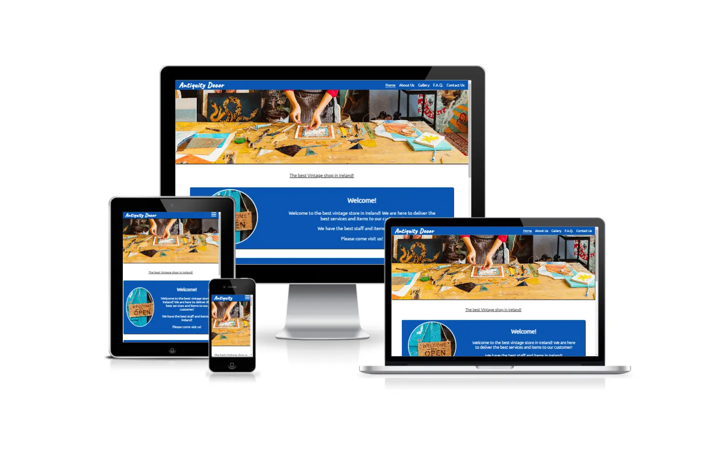

# Antiquity Decor

Developer: Freedy Ramos

[Live page](https://freedy-fr.github.io/CI-P1-Antiquity-Decor/)

## Table of Content

1. [Project Goals](#project-goals)
    1. [User Goals](#user-goals)
    2. [Owner Goals](#owner-goals)

## Project Goals

### User Goals

- Find a good quality vintage store with a nostalgic enviroment.
- To see pictures of the products on sale.
- To find information about services and products.
- Find information about times and location.
- Access to Frequently Asked Questions about the store.

### Owner Goals

- To increase the flux of customer to the store.
- To promote the business to the public.
- To give information like e-mail and contact numbers to the public.
- To provide information about services and products to customers.

