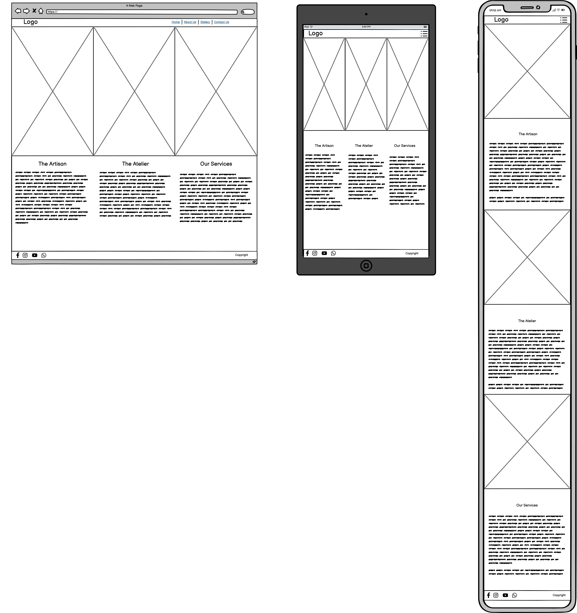
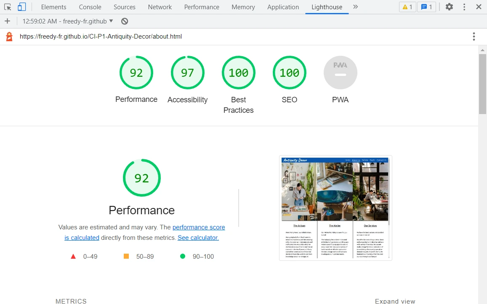

# Antiquity Decor

Developer: Freedy Ramos

[Live page](https://freedy-fr.github.io/CI-P1-Antiquity-Decor/)

## Table of Content

1. [Project Goals](#project-goals)
    1. [User Goals](#user-goals)
    2. [Owner Goals](#owner-goals)
2. [User Experience](#user-experience)
    1. [Main Audience](#main-audience)
    2. [User Requirements and Expectations](#user-requirements-and-expectations)
    3. [User Stories](#user-stories)
3. [Design](#design)
    1. [Design Choices](#design-choices)
    2. [Colour](#colour)
    3. [Fonts](#fonts)
    4. [Structure](#structure)
    5. [Wireframes](#wireframes)
4. [Technologies Used](#technologies-used)
    1. [Languages](#languages)
    2. [Frameworks & Tools](#frameworks-&-tools)
5. [Features](#features)
    1. [Logo and Navigation Bar](#logo-and-navigation-bar)
    2. [Welcome Section](#welcome-section)
    3. [Store Section](#store-section)
    4. [Footer](#footer)
    5. [About Us](#about-us)
    6. [The Products](#the-products)
    7. [The Frequently Asked Question](#the-frequently-asked-question)
    8. [Submission Form](#submission-form)
    9. [Interactive Map](#interactive-map)
    10. [Contact Info](#contact-info)
    11. [Gallery](#gallery)

## Project Goals

### User Goals

- Find a good quality vintage store with a nostalgic enviroment.
- To see pictures of the products on sale.
- To find information about services and products.
- Find information about times and location.
- Access to Frequently Asked Questions about the store.

### Owner Goals

- To increase the flux of customer to the store.
- To promote the business to the public.
- To give information like e-mail and contact numbers to the public.
- To provide information about services and products to customers.

## User Experience

### Main Audience

- Customers searching for vintage items.
- Customers looking to restore a vintage item.
- People with an interest in vintage/classic items.
- Designers with an interest in vintage decoration.
- Customers looking for a specific classic item.

### User Requirements and Expectations

- To access a working website with no broken links or bugs.
- An easy-to-find essential information about the store.
- A nice and clean navigation throughout the website.
- Visually clean and clear design in different types of devices.
- Multiple ways to contact the store.
- A way to leave a message outside of business hours.
- Clear accessibility for the impaired.

### User Stories

#### First Time Users

1. As a first time user, i want to have an idea of the store environment.
2. As a first time user, i want to know more about the artisan.
3. As a first time user, i want to know the location of the store.            
4. As a first time user, i want to know more about the services.
5. As a first time user, i want to see a frequently asked questions about the store.
6. As a first time user, i want to know more about the products.

#### Returning Users

7. As a returning user, i want to find the phone number to contact the store.
8. As a returning user, i want to see a short video of the store.
9. As a returning user, i want to see more items being sold.
10. As a returning user, i want to know the opening and closing times.
11. As a returning user, i want to be able to make a complaint.
12. As a returning user, i want to be able to get directions to the store.
13. As a returning user, i want to check the social media news and pictures.

#### Site Owner

14. As the site owner, i want the users to be able to get in contact.
15. As the site owner, i want the users to have a easy to use mobile menu.
16. As the site owner, i want the users to feel welcomed to the store.

## Design

### Design Choices

The projected website was designed to have a nostalgic vintage feel with the pictures being colorful.
Some of the images are round or elipses with some white border like the old round mirrors.

### Colour

The colour scheme was chosen to be simple in variety but to contrast with the colorful pictures throughout the website. The colours were checked on webAIM contrast checker to fit accessibility needs.

### Fonts

The font for the logo is Caveat with a fallback to cursive to match the vintage handwriting style.
 
The font for the body is Ubuntu with a fallback to sans-serif.

### Structure

The page is structured in a clean, tidy and friendly way, like most of the big websites to make it easifor to the user to acclimatedated to the navigation.

The website consist of five different pages:

- A Homepage with an warming welcome message, a brief description of the store and products.
- A About Us page with the description of the Artisan, The Atelier and our services.
- A Gallery page with some products pictures and a brief video of work being done at the workshop.
- A Frequently Asked Question - F.A.Q page with the most common questions and answers.
- A Contact Us page with information about the store location, contact phones and a submission form.

### Wireframes

Home

About

Gallery

F.A.Q.

Contact

## Technologies Used

### Languages

- HTML
- CSS

### Frameworks & Tools

- Git
- GitHub
- Gitpod
- Cloudconvert.com
- Balsamiq
- Google Fonts
- Font Awesome
- Favicon.io

## Features

The page consists of five pages and eleven features.

### Logo and Navigation Bar

- The navigation bar is responsive throughout all devices.
- The navigation bar is consistent throughout the website pages.
- The navigation menu toggles to a bars menu (hamburger) on mobile and tablet-size screens.
- User stories covered: 14.

### Welcome Section

- Gives the user the welcome feeling at the home page of the website.
- User stories covered: 15.

### Store Section

- Gives the user the felling of the store enviroment. 
- User stories covered: 1.

### Footer

- The footer is responsive throughout all devices.
- The footer is consistent throughout the website pages.
- The footer consist of the social medias icons and links and the copyright message.
- The footer is clean to focus on the social media icons and links.
- User stories covered: 13.

### About Us

- Describes The Artisan, The Atelier and Our Services.
- User stories covered: 2,4.

### The Products

- Gives a brief description of the products.
- User stories covered: 6.

### The Frequently Asked Question

- The Frequently Asked Questions -F.A.Q. section gives the customer a quick answer to the most common questions .
- User stories covered: 5.

### Submission Form

- The Submission Form located at the Contact Us page allowing the users to submit messages and make complaints.
- User stories covered: 11,14.

### Interactive Map

- The interactive google map is located at the right side of the Contact Us page and lets the users see the directions to the store.
- User stories covered: 3,12.

### Contact Info

- The Contact Info Section is located at the bottom part of the Contact Us page
- Allows the user to see the address, phone and e-mails on the left side and opening times on the right side.
- User stories covered: 7,10.

### Gallery

- The Gallery page allows the user to see some of the products images as well as a short video of the Atelier.
- User stories covered: 8,9.

## Validation

### HTML Validation

The W3C Markup Validation Service was used to validate the HTML URL of the 
 deployed website and the code by direct input. 
All pages passed with no errors no warnings to show.

Home

About

Gallery

F.A.Q.

Contact

404 page

 

### CSS Validation

The W3C Jigsaw CSS Validation Service was used to validate the CSS of the website URL and by direct input.
All pages passed with no errors no warnings to show.

Website URL

Website by Direct Input

 

### Accessibility

The WAVE WebAIM web accessibility tool was used to ensure the website met high accessibility standards. 
All pages passed with no errors.

Home

About

Gallery

F.A.Q.

Contact

404 page

 

### Performance

Google Lighthouse on Google Chrome Developer Tools was used to test the performance throughout the website.

Home

About

Gallery

F.A.Q.

Contact

404 page

 

### Performing tests on various devices 

The website was tested on the following devices.

- Galaxy Samsung S10+
- Galaxy Samsung S22 Ultra
- Surface Pro 8 (Tablet and Desktop mode)

The website was tested with Google Chrome Developer Tools throughout the available screen sizes.

